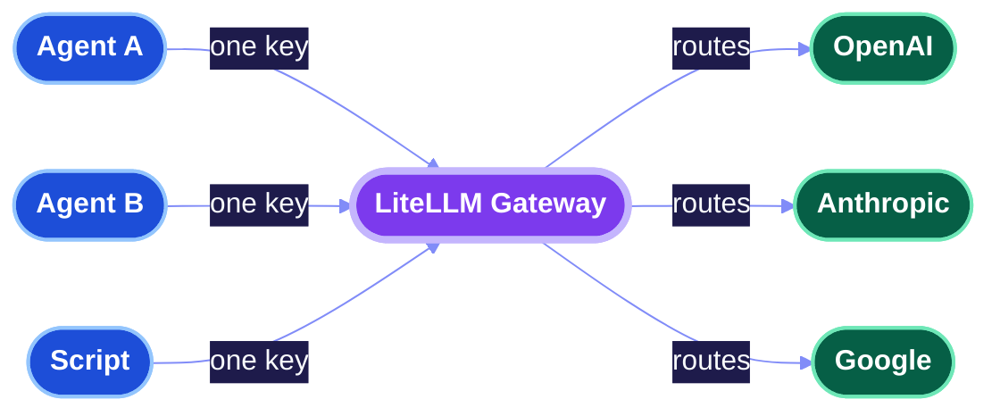
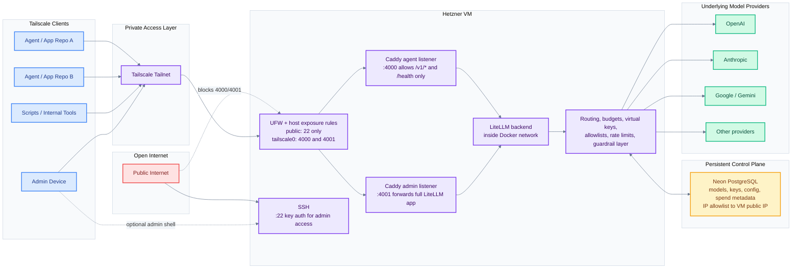

# LiteLLM Remote Server Instructions

This repo is the working setup guide for a cloud-hosted LiteLLM gateway that gives you a single control point for model access, routing, spend control, and operational visibility.

## How to think about this

If you've not used LiteLLM before: it's a proxy that sits between your code and AI providers. Your apps send requests to one place in one format, and LiteLLM routes them to whichever AI provider is appropriate — handling keys, budgets, and rate limits centrally so individual apps don't have to.



Your apps never hold real provider API keys — only a LiteLLM virtual key that you can revoke, cap, or restrict to specific models. The rest of this setup adds Tailscale and Caddy on top so the gateway itself is only reachable by authorised devices, not the open internet.

## Architecture at a glance



The practical shape is: Tailscale is the only entry point, agents use `:4000`, admins use `:4001`, and LiteLLM itself is not published directly on the public host interface.

Tailscale controls who can reach the gateway at all. The agent listener on `:4000` adds a second constraint: it allowlists only `/v1/*` and `/health`, so a compromised agent or stolen virtual key cannot reach LiteLLM's management API (key generation, model management, spend logs, config changes) even from inside the tailnet. Port `:4001` forwards everything and is for admins only.

## Quickstart: get access for a new agent

If the server already exists and you just need to use it, you only need:

1. The gateway base URL on the tailnet, for example `http://litellm.your-tailnet.ts.net:4000`
2. A LiteLLM virtual key created for your agent
3. One allowed model alias, for example `gpt-5` or `claude-sonnet`

Use the gateway like any OpenAI-compatible endpoint:

```python
from openai import OpenAI

client = OpenAI(
    api_key="YOUR_LITELLM_VIRTUAL_KEY",
    base_url="http://litellm.your-tailnet.ts.net:4000",
)

response = client.chat.completions.create(
    model="MODEL_ALIAS",
    messages=[{"role": "user", "content": "Hello"}],
)

print(response.choices[0].message.content)
```

Do not use raw provider keys directly. Access should be through LiteLLM virtual keys so spend limits, revocation, and model allowlists remain centralized.

Recommended endpoints:

- agents: `http://litellm.your-tailnet.ts.net:4000`
- admins: `http://litellm.your-tailnet.ts.net:4001/ui/`

## Docs map

- [Aims](docs/aims.md)
- [Setup Guide](docs/setup.md)
- [Why Use LiteLLM](docs/why-use-litellm.md)
- [SSH Backups](docs/ssh-backups.md)

## Repo layout

- `deploy/litellm/`: templates to copy onto the VM
- `deploy/caddy/`: reverse-proxy template used for the default Tailscale-only architecture
- `scripts/`: helper scripts for bootstrap and secret generation

Start with [docs/setup.md](docs/setup.md) if you are building the environment from scratch.
